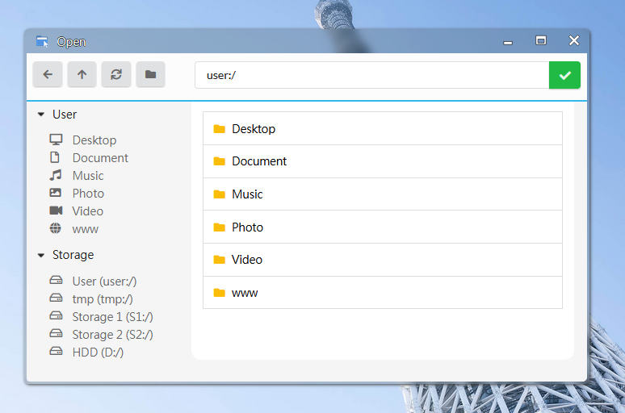

## Requirements

Same as the use of Float-Window API, some of the functions involving ao_module wrapper will require the following library to be imported.

```html
<script type="text/javascript" src="../script/jquery.min.js"></script>
<script type="text/javascript" src="../script/ao_module.js"></script>
```

*Note that **jquery must be imported before ao_module.js  AND ao_module must be imported with relative path to current script** to make sure all the ao_module functions are usable.*

-----

## File Selector

ArozOS has a build-in file selector which you can utilize in your WebApp as well as some utilities function to help you build a WebApp easily with file selection functions.

#### 🔹 ao_module_openFileSelector(callback,root="user:/", type="file",allowMultiple=false, options=undefined)

openFileSelector allow user to pick a file from their **cloud virtual drives.** Once this function is called, the cloud file selector will be shown in a new float window.



#### Select File Type

There are 4 supported file types which you can use in the ```type``` field

| Type Key | Selectable Items                                          |
| -------- | --------------------------------------------------------- |
| file     | Files only                                                |
| folder   | Folders only                                              |
| all      | File or folder                                            |
| new      | Create new file, require options.defaultName to be filled |


Here is an example usage

```js

//Options are optional values
let options = {
    defaultName: "newfile.txt",            //Default filename used in new operation
    fnameOverride: "myfunction",           //For those defined with window.myfunction / or script with type="module"
    filter: ["mp3","aac","ogg","flac","wav"] //File extension filter
}

//Handler function to process the selected files
function fileSelected(filedata){
    for (var i=0; i < filedata.length; i++){
        var filename = filedata[i].filename;
        var filepath = filedata[i].filepath;
        //Do something here with the selected file
    }
}

//Call to the open file selector API
ao_module_openFileSelector(fileSelected, "user:/Desktop", "file", true, options);
```


#### 🔹 ao_module_selectFiles(callback, fileType="file", accept="*", allowMultiple=false)

selectFiles function allow user to pick a file from their **local devices**. This will create a native file selector that allow the user to pick a file from their computer. The function return a (list of) files.

## File Locating

#### 🔹 ao_module_openPath(path, filename=undefined)

openPath allows WebApp to launch a new instance of File Manager and load a preset path. If filename was given, the target file will be highlighted in the File Manager.


## File Passing

File passing in ArozOS is done via hash values in URL. The hash value are encoded array of JSON object with filename and filepath properties. The encoding logic is shown in the example below.

```js
let filedata = [{
	"filename": "test.jpg",
	"filepath": "user:/Desktop/test.jpg"
}];

let fileHash =  encodeURIComponent(JSON.stringify(filedata));
//WebApp embedded pages are requested with something like YourApp/embedded.html#{{fileHash_here}}
```


#### 🔹 ao_module_loadInputFiles()

loadInputFiles return a list of files passed by other modules (mostly File Manager or Application Launcher). The returned value will have the identical structure as a standard ArozOS file passing file data. Here is an example of such structure.

```json
[
{
	"filename": "test.jpg",
	"filepath": "user:/Desktop/test.jpg"
},
{
	"filename": "test2.jpg",
	"filepath": "user:/Desktop/test2.jpg"
}
];
```

*If there are no file passing hash found, the function return ```null```.*

## File Upload

File upload in ArozOS is a bit complex as ArozOS is designed to support low end devices with little hardware resources. If possible, please try to avoid handling uploading large files in your WebApp and use the File Manager instead. 

#### 🔹 ao_module_uploadFile(file, targetPath, callback=undefined, progressCallback=undefined, failedcallback=undefined)

uploadFile handle small files upload using xhr requests. 

| Parameter        | Usage                                           | Example / Return Value                                       |
| ---------------- | ----------------------------------------------- | ------------------------------------------------------------ |
| file             | The file object to upload (type **`File`**)     |                                                              |
| targetPath       | The target virtual path for uploading this file | ```user:/Desktop/```                                         |
| callback         | Callback function on upload completed           | Return the upload target response, usually "ok"              |
| progressCallback | Callback function on progress change            | ```function displayProgress(completePercentage){console.log(completePercentage + "% uploaded")}``` |
| failedcallback   | Callback function on upload failed              | Return status code of xhr request                            |

#### WebSocket Upload / Low Memory Upload Mode (NOT RECOMMEND)

*It is generally **not recommend your WebApp to handle any kind of large file upload** as this might effect system stability when using with low power hardware. However, if you have specific use case, it is still possible for developers to develop a system that allow files larger than RAM size to be uploaded.*

When a large file is required to upload through your WebApp, you can use the websocket upload method. The steps for uploading via websocket works as followings.

1. Open a WebSocket connection
2. Upload one chunk of the selected file
3. Wait for server write and return "next"
4. Repeat step 2 until all file chunks are uploaded
5. Send "done" to server
6. Wait for server to merge the file and reply "ok"
7. Close the connection with success message


You can make a websocket request to ```/system/file_system/lowmemUpload``` and upload chunks of files in sequence. Here is an example code for details implementation.

```js
/*
	Low Memory Upload Mode
	
	Assume the file you want to upload is stored in "file" object
*/
var uploadFileChunkSize = 1024 * 512; //512KB per chunk in low memory upload
var largeFileCutoffSize = 8192 * 1024 * 1024; //Any file larger than this size is consider "large file", default to 8GB

var filename = encodeURIComponent(file.name);
var filesize = file.size;

//Open the websocket
let path = "user:/Desktop";
let protocol = "wss://";
if (location.protocol !== 'https:') {
	protocol = "ws://";
}

var port = window.location.port;
if (window.location.port == "") {
	if (location.protocol !== 'https:') {
		port = "80";
	} else {
		port = "443";
	}
}

let uploadDir = "user:/Desktop";

//Fixing Firefox path issues on or above FF48.0
if (isFirefox && file.webkitRelativePath != "") {
	//Use the webkitRelativePath instead of the name, this is a folder upload
	let pathinfo = file.webkitRelativePath.split("/");
	pathinfo.pop();
	let subpath = pathinfo.join("/");
	uploadDir = uploadDir + subpath;
}

let hugeFileMode = "";
if (file.size > largeFileCutoffSize) {
	//Filesize over cutoff line. Use huge file mode
	hugeFileMode = "&hugefile=true";
}


let socket = new WebSocket(protocol + window.location.hostname + ":" + port + "/system/file_system/lowmemUpload?filename=" + filename + "&path=" + uploadDir + hugeFileMode);
let currentSendingIndex = 0;
let chunks = Math.ceil(file.size / uploadFileChunkSize, uploadFileChunkSize);

//Define a function for sending a particular chunk
function sendChunk(id, uploadingIconUUID) {
	let offsetStart = id * uploadFileChunkSize;
	let offsetEnd = id * uploadFileChunkSize + uploadFileChunkSize;
	let thisblob = file.slice(offsetStart, offsetEnd);
	socket.send(thisblob);

	//Update progress to first percentage
	let progress = id / (chunks - 1) * 100.0;
	if (progress > 100) {
		progress = 100;
	}
	console.log("Uploading " + progress + "%");
}

//Start sending
socket.onopen = function(e) {
	//Send the first chunk
	sendChunk(0, uploadingIconUUID);
	currentSendingIndex++;
};

socket.onmessage = function(event) {
	//Append to the send index
	var incomingValue = event.data;

	if (incomingValue == "next") {
		if (currentSendingIndex == chunks + 1) {
			//Already finished
			socket.send("done");
		} else {
			//Send next chunk
			sendChunk(currentSendingIndex, uploadingIconUUID);
			currentSendingIndex++;
		}

	} else if (incomingValue == "OK") {
		//Merge completed

	} else {
		//Try to parse it as JSON
		try {
			var resp = JSON.parse(incomingValue.split('\\' + '"').join("\""));
			console.log(resp);
			if (resp.error !== undefined) {
				//This is an error message
				console.log("Upload Failed", resp.error);
			}
		} catch (ex) {
			//Something else
			console.log(incomingValue);
			console.log(ex);
		}
	}

};

socket.onclose = function(event) {
	//Upload completed
    alert("upload completed");
};

socket.onerror = function(error) {
	console.log(error.message);
	//Do something to handle the upload fail
};
```


## Deprecated

```ao_module_codec``` was used during the ArOZ Online Beta (AOB) era to handle cross frame unicode file passing issues. If you are trying to migrate a module from AOB to ArozOS, please remove all of the usages of these functions.

```js
ao_module_codec.decodeUmFilename(umfilename_here);
ao_module_codec.encodeUMFilename("test.stl");
ao_module_codec.decodeHexFoldername(hexFolderName_here);
ao_module_codec.encodeHexFoldername("test");
```

*From ArozOS v1.0 onward, the core was developed with UTF-8 support. Hence, these functions are no longer required.*
