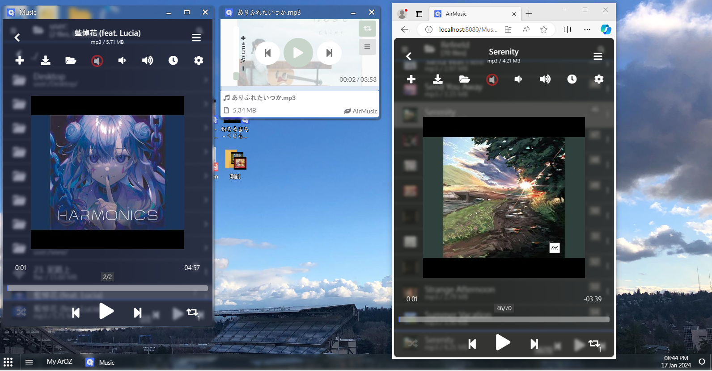

The start script (or commonly known as the ```init.agi``` file), is the config and environment checking script that allow ArozOS to know the given folder is a WebApp instead of a resources file.  This file define the way and specification on how to launch the WebApp module on the web desktop interface.

Here is a minimal example of the init.agi file.

```javascript
/*
	Example Module
	author: tobychui
	
	This module is just an example for showcasing
	the basics of how agi scripting works with the
	front-end in ArozOS environment
*/

//Define the launch settings for the module
var moduleLaunchInfo = {
    Name: "Example",
    Group: "Interface Module",
    IconPath: "Example/img/small_icon.png",
    Version: "1.0",
    StartDir: "Example/index.html"
}

//Register the module
registerModule(JSON.stringify(moduleLaunchInfo));
```

When the ```registerModule``` function is called, it will register the given Example module with ArozOS and all users with permission can access the resources in this module.

## Module Info Structure

Module info is a JSON object that is required by ArozOS to register your webapp. The object should contains the following fields

| Key          | Usage                                                        | Optional |
| ------------ | ------------------------------------------------------------ | -------- |
| Name         | Display name of the module                                   |          |
| Desc         | Simple description of what the module does                   | ✔️        |
| Group        | Catergory group of the module                                |          |
| IconPath     | Icon of the module, use in float window title                |          |
| Version      | Version of the module                                        |          |
| StartDir     | Starting path of the module, **must include module root folder name** |          |
| SupportFW    | If the module support float window mode                      | ✔️        |
| LaunchFWDir  | Float window launching directory, **must include module root folder name** | ✔️        |
| InitFWSize   | Default float window size for this webapp                    | ✔️        |
| SupportEmb   | If the module support embedded mode                          | ✔️        |
| LaunchEmb    | Embedded window launching directory, **must include module root folder name** | ✔️        |
| InitEmbSize  | Default embedded window size for this webapp                 | ✔️        |
| SupportedExt | Formats that this webapp can open                            | ✔️        |

Here is another example containing all options usable in the module launch info.

```javascript
{
    Name: "Music",
	Desc: "The best music player in ArOZ Online",
	Group: "Media",
	IconPath: "Music/img/module_icon.png",
	Version: "0.1.0",
	StartDir: "Music/index.html",
	SupportFW: true,
	LaunchFWDir: "Music/index.html",
	SupportEmb: true,
	LaunchEmb: "Music/embedded.html",
	InitFWSize: [475, 720],
	InitEmbSize: [360, 254],
	SupportedExt: [".mp3",".flac",".wav",".ogg",".aac",".webm",".mp4"]
}
```

### Default vs Float Window vs Embedded Mode

If a user is trying to open a module in web desktop environment, the float window path will be used to start the module. If the float window path is not set, the default (start dir) will be used as fallback.

The embedded path is only used when a user trying to open a file with the module. In such case, a file info hash will be passed to the starting script location. See **WebApp Front-end Development** section for more information.

| Mode          | Viewport                                                     | Module Info Path Definition Key |
| ------------- | ------------------------------------------------------------ | ------------------------------- |
| Default       | Viewing as standard website or PWA                           | StartDir                        |
| Float Window  | Viewing as a floating window in web desktop mode             | LaunchFWDir                     |
| Embedded Mode | When a file info parameter is passed to the module for opening | LaunchEmb                       |



From the above screenshot, left: float window | middle: embedded mode | right: default (stand-alone browser window), capture under ArozOS web desktop mode

------

#### Developer Notes

Due to the execution scope and security reasons, only function in standard library and appdata library are usable within the start script. No other user functions (e.g. filelib) are usable. Please refer to the library pages for more details.


